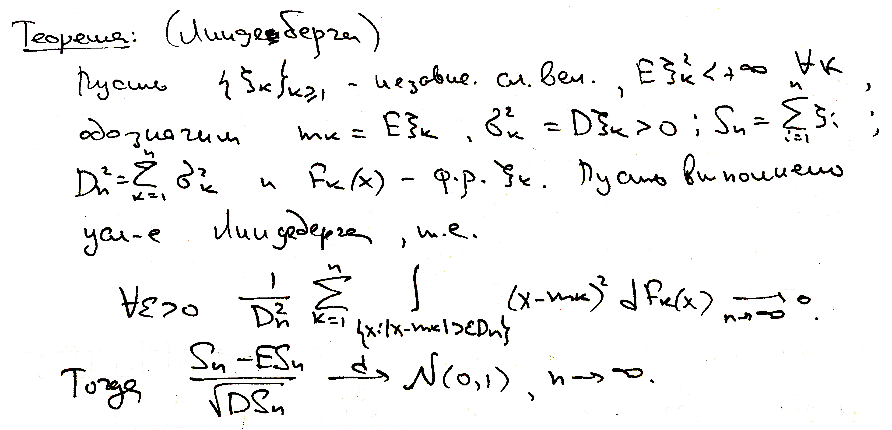
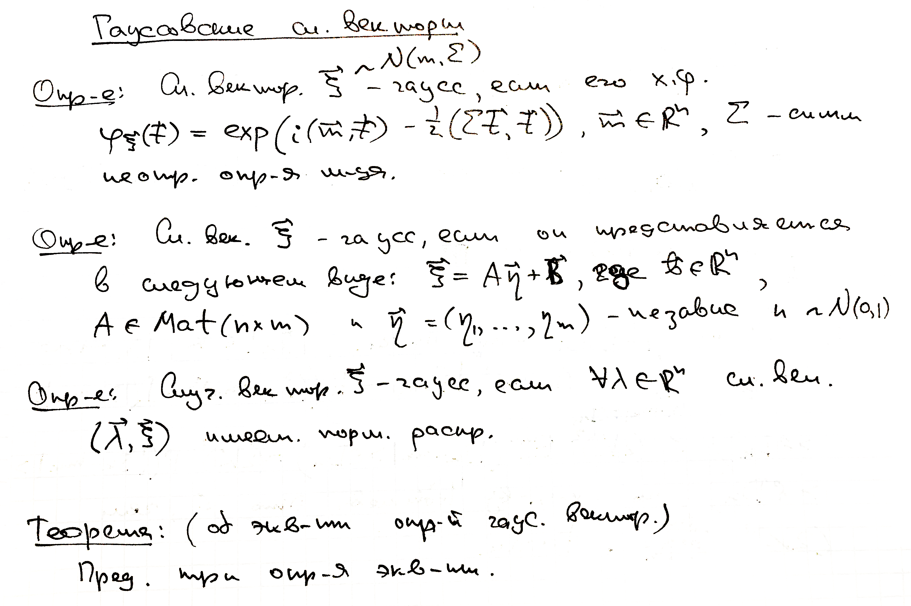
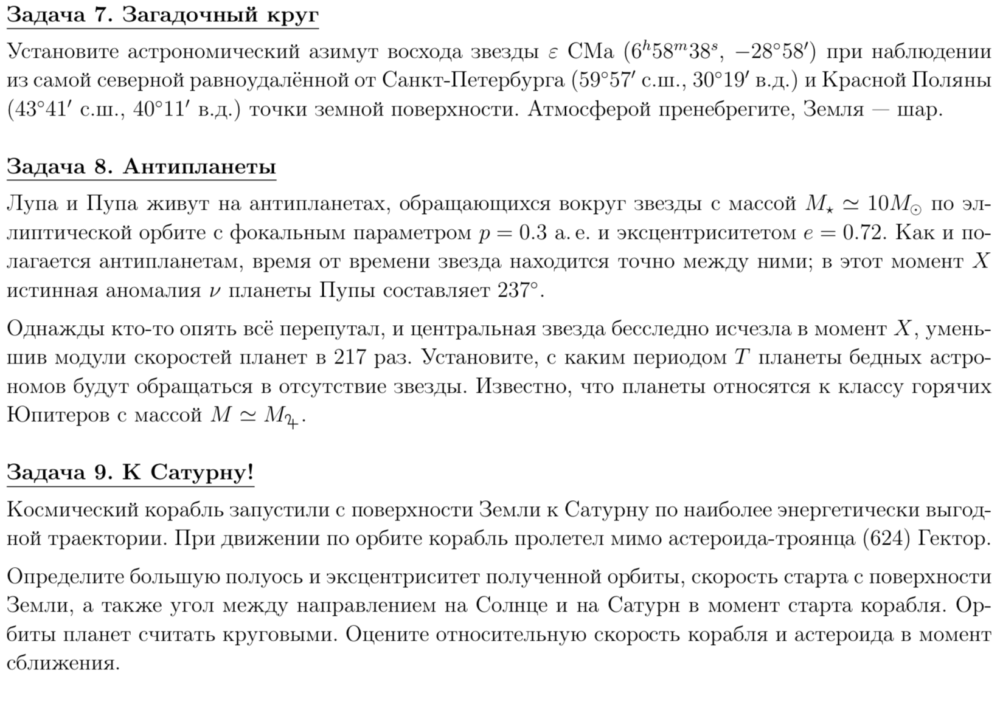
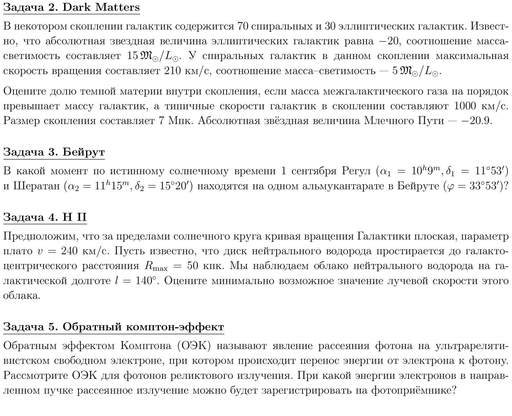

## Домашнее задание №2
Данное задание будет состоять из нескольких частей :))

### Для начала

В documentclass необязательным аргументом укажите, что будете набирать текст шрифтом размера 11pt. А с помощью пакета geometry настройте размер бумаги a5 и поля 1 см со всех сторон.

### Первая часть

Вам предлагается затехать два небольших отрывка рукописного конспекта лекций по курсу теории вероятностей в 4 семестре.  

* Раздел, к которому относится первая теорема называется "Центральная предельная теорема".
* Пару слов об обозначениях: $ \mathsf{D} \xi_k, \mathsf{E} \xi_k, \mathcal{N}(0,1), \mathbb{R}$. $\text{Mat}$ – это оператор.
* Теоремы и определения предлагается оформить с помощью пакета amsthm, о котором говорилось на занятии. Пусть у теорем будет нумерация внутри каждого раздела, а у определений – сквозная по всему документу.
* Задание со звездочкой: определить собственный стиль "теоремы" для определений.
* Как и полагается в хорошем печатном материале, все сокращение нужно будет развернуть. Словарь:
	

| Сокращение | Расшифровка |
|------------|-------------|
| сл. вел.| случайная величина|
| сл. век.| случайный вектор|
| м-ца | матрица |
| независ. | независимый |
| усл-е | условие |
| опр-е | определение |
| x. ф. | характеристическая функция|
| неотр. опр-я | неотрицательно определенная |
| норм. распр | нормальное распределение |
| т. е. |  то есть |

### Вторая часть

Создайте свое окружение для оформления задач. Окурежение должно иметь счетчик и один аргумент для передачи названия зачачи. Счетчик должен иметь вид "section#.env#". Создайте раздел "Задачи по астрономии" и наберите несколько (>= 4). Задачи можно взять отсюда:

Оформлять окружение именно так, как это сделано в примере – не обязательно, можно придумать что-то свое.

### Третья часть

В новом раделе "Отзыв" создайте список или перечень со **своим оформлением нумерации**. И пусть пунктами будут ответы на вопросы: как вам курс? Что скажете про организация курса, качество материала и качество его преподношения?
