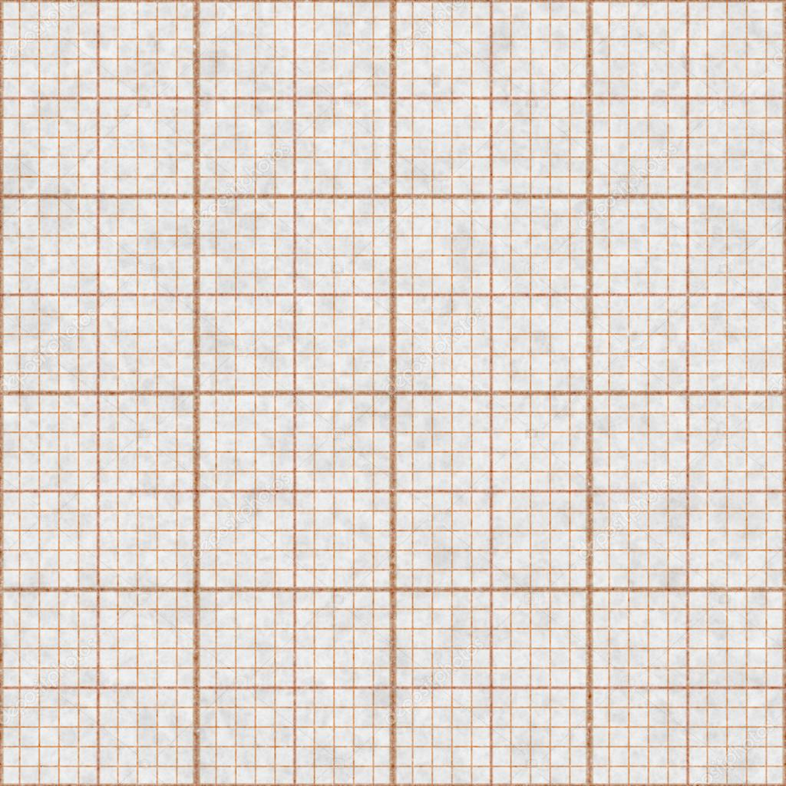

## Домашнее задание №4

1. Миллиметковка – полезная в жизни вещь. Вам предлагаеся создать свою миллиметровую бумагу формата а4 (например, 19 см x 28 см), используя возможность пакета TikZ. Стоит сделать отдельным документом. Пример рисунка миллиметровой бумаги:

*Cледующие пункты лучше делать в одном документе.*

2.  файле "/gen.py" приведен код на языке Python, который генирирует данные для следующего задания. Вам предлагается его красиво оформить, используя средства пакета listing.

3. В файле "/data.dat" приведены синтетические экспериментальные данные исследования линейной зависимости вида $y = ax+b$. МНК по этим данным дает следующие результаты: $a = 3.0612$, $b = 2.6882$. С помощью pgfplots постройте график, накотором будет облако точек экспериментальных данных и прямая $y = ax+b$, которой их можно аппроксимировать.

4. *Создать свое оформление колонтитулов. 

Обещал же небольшое задание :)
В первую очередь будет оцениваться гармоничность оформления. 

